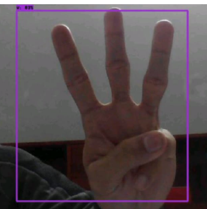
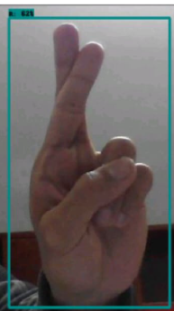

# Human Hand Gesture Recognition (Sign Language Detection)

This repository implements a **real-time sign-language recognition system** using **TensorFlow Object Detection API**. The project captures hand gestures (including the American Sign Language alphabet) via a webcam (OpenCV), detects and localizes hands, and maps detected gestures to alphabet letters or common gestures. 

---

## 🔎 Key Highlights

- Real-time detection via webcam using OpenCV.
- Transfer learning from a COCO-pretrained MobileNet SSD (V2) backbone.
- Training and inference using TensorFlow Object Detection API.
  
---

## 📁 Repository Structure

```
.
├─ workspace/
│  ├─ images/
│  │  ├─ train/                # training images
│  │  └─ test/                 # testing images
│  ├─ annotations/            
│  │  ├─ label_map.pbtxt       # LabelMe JSON / XML annotations
│  │  ├─ train.record          # TFRecord for training
│  │  └─ test.record           # TFRecord for evaluation
│  ├─ models/                  # trained model checkpoints
│  │  ├─ my_ssd_mobnet
│  ├─ pre-trained models       # pre-trained SSD-MobNet model checkpoints    
├─ scripts/
│  ├─ generate_tfrecord.py     # convert annotations -> TFRecord
├─ README.md
└─ requirements.txt
```

---

## 🧩 Dataset & Annotation

- The dataset contains images for **26 alphabet signs (A–Z)** and additional custom gestures. Some data were pre-annotated; other images were captured with a webcam and annotated manually using **LabelMe**.
- Annotations include bounding boxes (coordinates) and class labels.
- A `label_map.pbtxt` file maps numeric class IDs to human-readable labels.
  
---

## 🛠 Tools & Frameworks

- Python 3.8+
- TensorFlow 2.x (Object Detection API v2)
- OpenCV (cv2) for webcam capture and display
- LabelMe for annotation (or any bounding-box annotation tool)
- `protoc` for compiling TF record utilities

---

## 🔧 Model architecture

MobileNetV2 + SSD (pretrained on COCO 2017, input 320×320). Transfer learning fine-tunes the detection head on the custom hand-gesture dataset.

---

## ✅ Results & Evaluation

- Two types of inference were run: (1) image-based testing on held-out images, and (2) **real-time webcam inference**.

- The model returns bounding boxes with class labels and confidence scores.

  

**Limitations observed:**
- Uncontrolled backgrounds and low-light conditions reduce accuracy.
- Varied skin tones, clothing, partial occlusions, and face presence can confuse the detector.
- Some similar letters or gestures are confused with each other — remedyable with more data and augmentation. fileciteturn1file0

---

## 🚀 Quickstart 

### 1) Clone repo
```bash
git clone <your-repo-url>
cd <repo-name>
```

Open `detection.ipynb' notebook.

### 2) Prepare dataset & label map
- Put images into `workspace/images/train` and `workspace/images/test`.
- Create a `label_map.pbtxt`.
- Ensure your `label_map.pbtxt` lists all classes (A–Z and custom gestures).

### 3) Install required libraries & TF Object detection API

### 4) Generate TFRecords
```bash
python scripts/generate_tfrecord.py -x "path to train images -l "path to label_map.pbtxt -o "path to store tf_records"
python scripts/generate_tfrecord.py -x "path to test images -l "path to label_map.pbtxt -o "path to store tf_records"
```

### 4) Training the model
```bash
python model_main_tf2.py --model_dir=models/my_ssd_mobnet --pipeline_config_path=models/my_ssd_mobnet/pipeline.config
```
---


